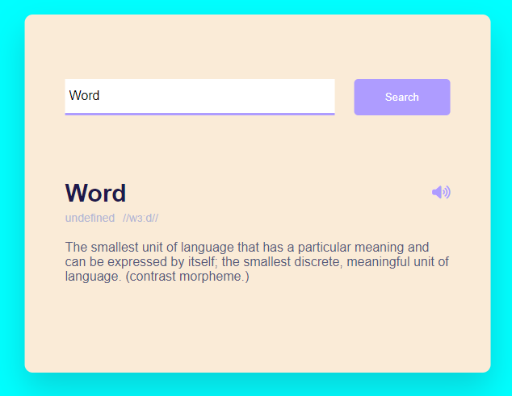
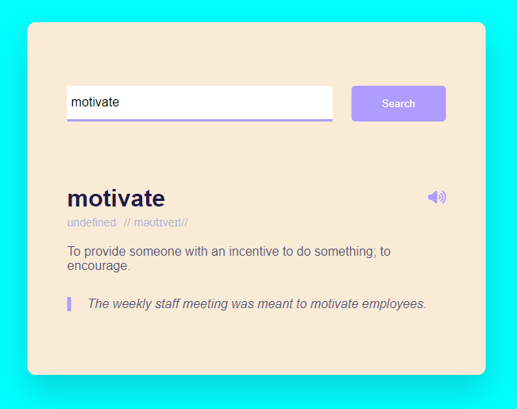

# 📚 Dictionary Project 📚

Welcome to the Dictionary Project! This application allows you to easily find the meanings of words and listen to their pronunciations in English.

## 🌟 Features

- **Search for Word Meanings**: Enter any word to get its definition.
- **Listen to Pronunciations**: Hear the correct pronunciation of the word in English.
- **User-Friendly Interface**: Simple and intuitive design for a seamless user experience.

## 🕹️ How to Use

1. **Search a Word**: Type the word you want to look up in the search bar and hit enter.
2. **View the Definition**: The meaning of the word will be displayed on the screen.
3. **Listen to Pronunciation**: Click the speaker icon to listen to the pronunciation of the word.

## 💾 How to Download and Run

1. **Download the ZIP File**:
   - Click on the green "Code" button at the top right of the repository page.
   - Select "Download ZIP".
   - Alternatively, you can clone the repository using the command: `git clone https://github.com/yourusername/dictionary-project.git`

2. **Extract the ZIP File**:
   - Extract the downloaded ZIP file to a folder on your computer.

3. **Open in Browser**:
   - Open the extracted folder.
   - Double-click on the `index.html` file.
   - The dictionary application will open in your default web browser, and you can start using it!

## 🖼️ Screenshots

Here are some screenshots of the Dictionary Project in action:

### Search Results for "Word"

### Search Results for "Motivate"

## 🙏 Thank You 🙏

Thank you for using the Dictionary Project! We hope it helps you in your journey to learn new words and improve your vocabulary.

---

Feel free to reach out if you have any questions or feedback. Enjoy using the dictionary!

